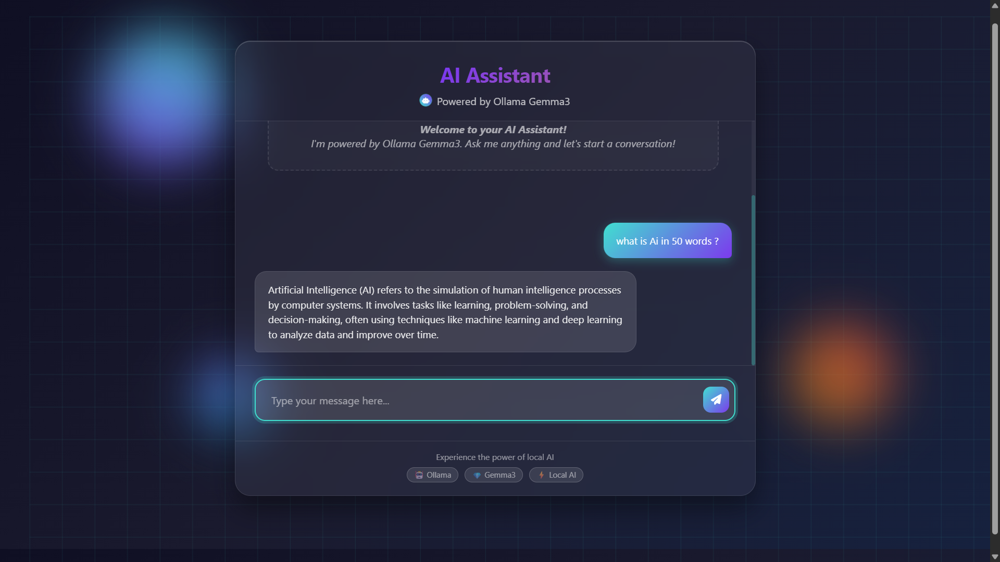

# 🤖 AI Chatbox — Powered by Ollama Gemma3

A sleek and fully functional **AI chat interface** built using **Flask** and **Gemma3 via Ollama**, featuring a **glassmorphism design**, animated effects, and a live streaming chat experience — all running **locally** without internet dependency.
---

## 🔧 Features
- 🌈 Elegant glass UI with animated background & floating elements
- 💬 Real-time chat with Ollama's **Gemma3**
- 📡 Fully offline AI interaction on `localhost:11434`
- ⚙️ Flask backend with stream-based response handling
- 📱 Mobile-responsive layout with smooth UX
- ✨ Typing effects, particle feedback, and auto-resizing input
---

